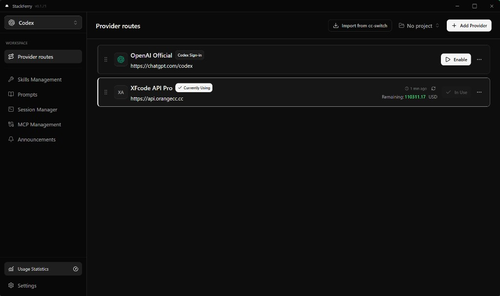
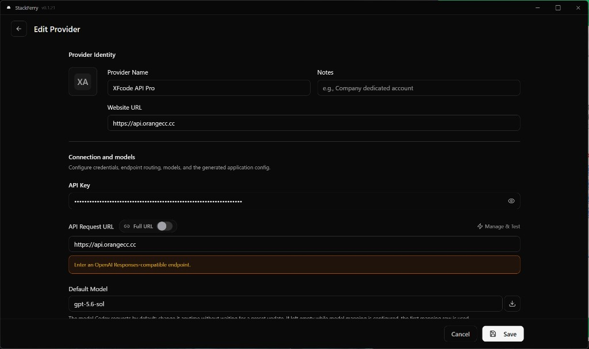
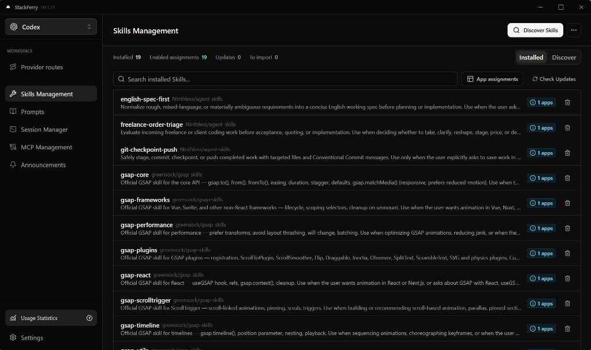
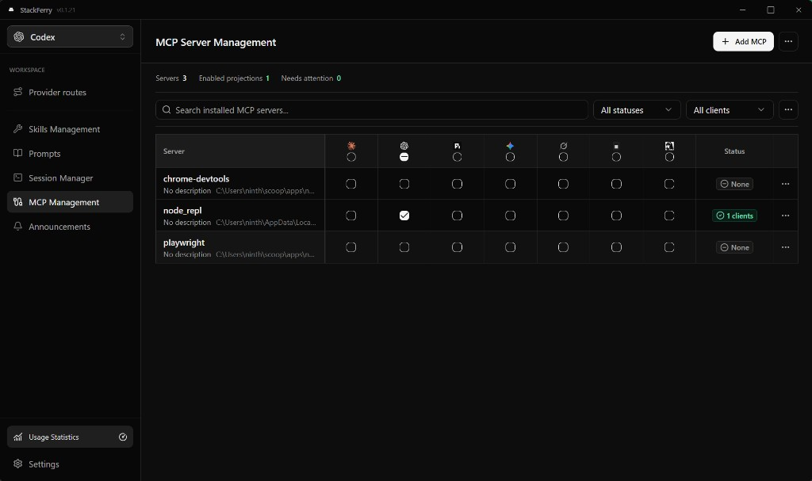
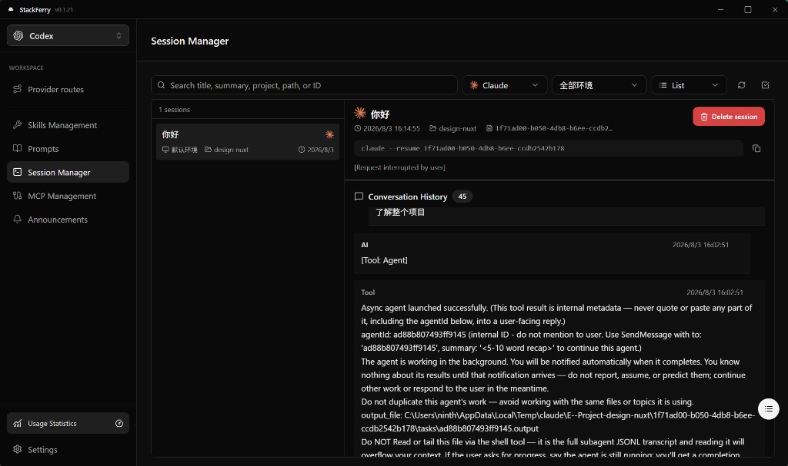
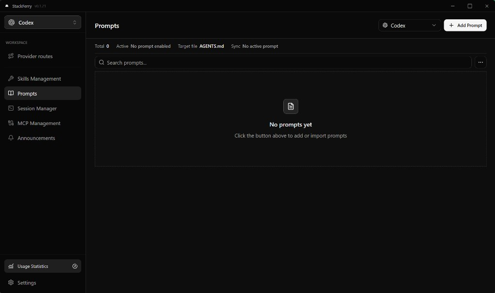

<div align="center">

# StackFerry

AI 编程工具的桌面配置与路由管理器

**简体中文** | [English](README.md)

[](https://github.com/Ninthless/StackFerry/releases/latest)
[](https://github.com/Ninthless/StackFerry/actions/workflows/ci.yml)
[](https://github.com/Ninthless/StackFerry/releases/latest)
[](LICENSE)

[下载最新版](https://github.com/Ninthless/StackFerry/releases/latest) · [全部版本](https://github.com/Ninthless/StackFerry/releases) · [发布说明](RELEASE.md)

</div>

StackFerry 是一个基于 Tauri 的桌面应用，用于统一管理 AI 编程工具的供应商、凭据、模型和当前路由。它同时提供本地请求路由、故障转移、Prompt 与 Skills 管理、MCP 配置、会话查看、用量统计和远程备份能力。

## 产品预览

<p align="center">
  
</p>

<p align="center">
  在一个桌面工作区中管理供应商、凭据、模型、Prompt、Skills、MCP 服务和编程会话。
</p>

<p align="center">
  
  
</p>

<p align="center">
  
  
</p>

<details>
<summary>查看更多截图</summary>

<p align="center">
  
</p>

</details>

## 核心能力

- **供应商管理：** 为每个受支持工具保存多组 API 供应商和模型配置，无需手动修改配置文件即可切换当前配置。
- **本地路由：** 通过本地代理转发兼容请求，支持请求与响应转换、流式传输、全局出站代理和供应商级选项。
- **故障转移：** 按优先级组织供应商，通过健康检查和熔断器将流量从不可用路由切走。
- **Prompt 与 Skills：** 按目标应用管理 Prompt；从仓库或 skills.sh 发现 Skills，导入 ZIP、安装 Skills，并恢复 Skills 备份。
- **MCP 服务：** 添加、导入 MCP 服务，并转换为各工具所需的原生配置格式。
- **会话与用量：** 搜索和查看本地会话、批量删除会话，并在工具或供应商提供数据时统计请求、Token 和费用。
- **同步：** 将应用数据和 Skills 备份到用户配置的 WebDAV 或 S3 兼容存储，并可启用自动同步。
- **工具维护：** 检测已安装 CLI 的版本，安装或升级受支持工具，并诊断多处安装冲突，包括 Windows 和 WSL 环境。

## 支持的工具

| 工具           | 供应商路由 | Prompt | Skills | MCP | 会话 |
| -------------- | :--------: | :----: | :----: | :-: | :--: |
| Claude Code    |     是     |   是   |   是   | 是  |  是  |
| Claude Desktop |     是     |   -    |   -    |  -  |  -   |
| Codex          |     是     |   是   |   是   | 是  |  是  |
| Pi             |     是     |   是   |   是   | 是  |  是  |
| Gemini CLI     |     是     |   是   |   是   | 是  |  是  |
| Grok Build     |     是     |   是   |   是   | 是  |  是  |
| OpenCode       |     是     |   是   |   是   | 是  |  是  |
| OpenClaw       |     是     |   -    |   -    |  -  |  是  |
| Hermes         |     是     |   是   |   是   | 是  |  是  |

各工具的原生配置格式不同，因此具体功能范围有所差异。OpenClaw 还提供工作区、环境变量、工具权限和 Agent 默认配置页面；Hermes 提供记忆管理和打开控制面板的入口。

## 下载与安装

请从 [GitHub 最新版本](https://github.com/Ninthless/StackFerry/releases/latest) 下载适合当前系统的软件包。Release 资产覆盖 Windows、macOS 和 Linux，具体安装格式与架构以各版本发布页面为准；Windows 版本在可用时也会提供便携版压缩包。

StackFerry 会发布带签名的应用内更新资产。平台相关注意事项请查看对应版本的发布说明。

## 快速开始

1. 安装需要由 StackFerry 管理的 AI 编程工具。
2. 启动 StackFerry，在应用切换器中选择目标工具。
3. 添加供应商，或检查首次启动时从现有配置导入的默认供应商。
4. 启用供应商，将其配置写入目标工具。
5. 仅在供应商或协议需要时开启本地路由；启用自动故障转移前，应先配置故障转移队列。
6. 根据实际目标应用，分别配置 Prompt、Skills、MCP、同步等可选功能。

StackFerry 使用独立的应用标识、数据目录、数据库、深链协议、同步命名空间和更新资产，不会覆盖 CC Switch 的应用数据。

## 功能说明

### Skills

Skills 可从已配置的 Git 仓库发现，也可通过 skills.sh 搜索。StackFerry 会在保存仓库前进行校验和扫描，并支持 ZIP 导入、备份恢复以及将指定 Skill 安装到指定目标应用。Skills 主副本可存放在 StackFerry 数据目录，也可使用开放标准目录 `~/.agents/skills`，再投影到兼容工具。

### 会话与用量

会话管理支持 Claude Code、Codex、Pi、Gemini CLI、Grok Build、OpenCode、OpenClaw 和 Hermes，包括搜索、按供应商或目录分组、查看详情和批量删除。用量统计会整合可用的本地会话日志与本地路由记录；Token、费用、订阅和供应商查询数据取决于具体工具与上游服务是否提供。

### 导入与同步

`stackferry://` 深链协议可导入受支持的供应商、Prompt、MCP 和 Skill 数据，应用会在导入前要求确认。WebDAV 与 S3 同步依赖用户自行配置并信任的远程存储。接受导入内容或启用远程同步前，请检查其中的配置与风险。

## 开发

### 环境要求

- Node.js 22.12.0 或更高版本
- pnpm 10.12.3
- Rust 1.95.0（受支持的开发与发布工具链）
- 当前操作系统对应的 [Tauri 2 前置依赖](https://v2.tauri.app/start/prerequisites/)

仓库已将 Tauri CLI 2 声明为开发依赖，无需单独全局安装 Tauri CLI。

### 启动项目

```bash
pnpm install
pnpm dev
```

`pnpm dev` 会启动完整 Tauri 应用，并将受支持工具的主目录重定向到 `.stackferry-dev/`，避免开发过程修改真实用户配置。仅调试不依赖原生后端的前端界面时，可使用 `pnpm dev:renderer`。

### 验证

```bash
pnpm verify
pnpm verify:full
```

`pnpm verify` 是跨平台开发门禁。`pnpm verify:full` 还会执行锁定依赖的 Rust 格式检查、覆盖所有 targets 且将警告视为错误的 Clippy，以及 Rust 测试。完整 Rust 验证需要当前 Windows、macOS 或 Linux 平台对应的 Tauri 原生前置依赖；单个平台通过不能替代三平台 CI 矩阵。发布打包与签名仍具有平台特异性。

架构验证会保护前端 capability 边界、Rust 依赖方向、直接 Tauri IPC 访问与源文件规模上限。现有例外冻结在经过审查的架构和文件规模基线中；`pnpm architecture:update` 会增量记录有意例外，不会在并行迁移期间删除无关条目。

CI scope、基线审查规则以及可选 pre-push hook 说明见 [CONTRIBUTING.md](CONTRIBUTING.md)。

### 构建命令

| 命令               | 输出                                                                      |
| ------------------ | ------------------------------------------------------------------------- |
| `pnpm build:fast`  | 使用 `fast-release` Rust profile 快速生成优化后的可执行文件，不生成安装包 |
| `pnpm bundle:fast` | 生成一个当前平台原生安装包：MSI、DMG 或 AppImage                          |
| `pnpm build`       | 完整生产构建，也是发布资产的构建基础                                      |

工作区配置会将 rust-analyzer 输出放到 `src-tauri/target/analyzer`，避免编辑器检查与 CLI 构建相互清除缓存。

## 项目结构

```text
src/                  React 与 TypeScript 前端
src-tauri/src/        Rust 命令、服务、数据库、路由与工具适配器
scripts/              开发、快速构建与发布清单脚本
tests/                前端组件与集成测试
.github/workflows/    CI 与多平台发布工作流
```

前端通过 Tauri 命令和事件与 Rust 后端通信。Rust 负责原生配置访问、SQLite 持久化、代理服务、同步、会话解析和系统集成。

## 发布流程

1. 将 `package.json`、`src-tauri/tauri.conf.json` 和 `src-tauri/Cargo.toml` 设为相同的 SemVer，并更新 `src-tauri/Cargo.lock` 中项目自身的版本。
2. 更新 `RELEASE.md`，并校验对应标签：

   ```bash
   pnpm release:validate v0.1.6
   ```

3. 提交版本变更，创建 `vX.Y.Z` 标签并推送。
4. GitHub Actions 会校验版本、构建多平台矩阵、收集带签名的更新资产、生成 `latest.json`，并发布 GitHub Release。

发布工作流需要仓库 Secret `TAURI_SIGNING_PRIVATE_KEY`。禁止将签名私钥提交到仓库。

## 数据与安全

- 供应商凭据和应用设置存储在 StackFerry 管理的本地配置与数据库文件中。不要将真实 API Key 或同步备份提交到版本控制。
- 本地路由与故障转移会改变工具请求的发送目标。启用前请检查供应商端点和路由设置，特别是涉及官方账号时。
- 第三方供应商、导入的深链、Skill 仓库、MCP 服务、脚本和同步端点都不属于 StackFerry 的信任边界，使用前应自行评估。
- 大规模调整配置前，请先备份重要的工具原生配置。远程同步不能替代经过独立验证的备份。

## 项目基础与许可证

StackFerry 源自 [CC Switch](https://github.com/farion1231/cc-switch) 3.19.0 代码库，并保留其 MIT 许可证、版权声明、署名和 Git 历史。StackFerry 作为独立项目维护，不会自动跟随 CC Switch 更新。

StackFerry 依据 [MIT License](LICENSE) 发布，并保留原始版权声明：

```text
Copyright (c) 2025 Jason Young
```

StackFerry 与 CC Switch 维护者及各受支持 AI 工具的厂商不存在隶属或背书关系。产品名称和商标归各自权利人所有。
