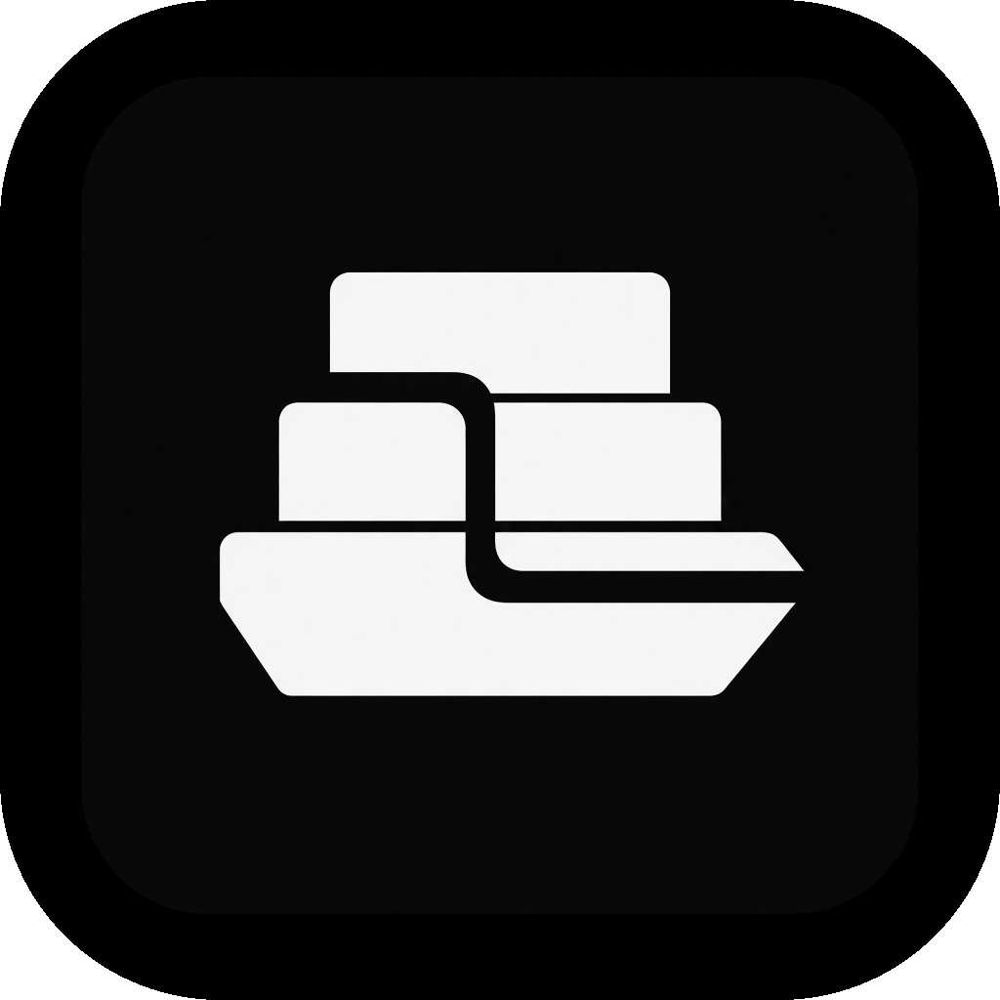
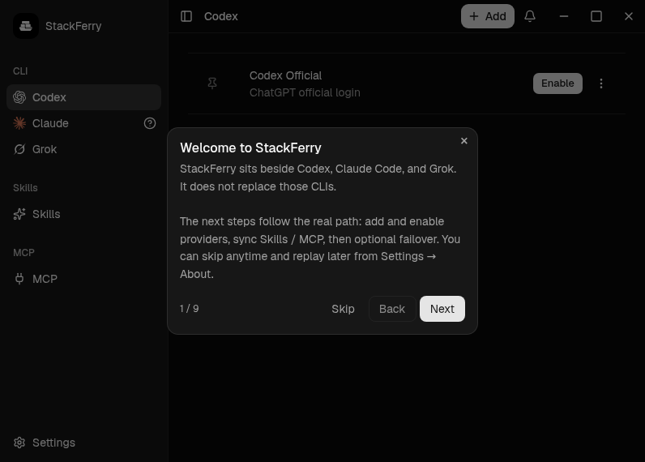

# StackFerry

<p align="center">
  
</p>

<p align="center">
  <a href="./README.md">English</a> · <b>简体中文</b>
</p>

<p align="center">
  <a href="https://github.com/Ninthless/StackFerry/releases/latest"></a>
  <a href="./LICENSE"></a>
  
  <a href="https://x.com/ninthless"></a>
</p>

给 Coding CLI 用的桌面控制面。供应商、本地 failover、Skills 和 MCP 收在一处，再写进你启用的那个 CLI。现在可用的是 Codex、Claude Code 和 Grok。以后会按同样的方式加入更多 CLI。

<p align="center">
  
</p>

<details>
<summary>演示</summary>

https://github.com/user-attachments/assets/d73a89a6-6dde-4cb2-8d1f-55257e16d8b3

</details>

StackFerry 不替代这些 CLI。它放在旁边：官方登录或自定义网关，写入前先备份，队列非空时在 `127.0.0.1` 做 failover。

## 目录

- [CLI](#cli)
- [它做什么](#它做什么)
- [安装](#安装)
- [使用](#使用)
- [macOS](#macos)
- [配置落点](#配置落点)
- [开发](#开发)
- [参与贡献](#参与贡献)
- [许可证](#许可证)

## CLI

| | |
| --- | --- |
| 现在 | Codex、Claude Code、Grok |
| 以后 | 更多 Coding CLI。每一家都走同一套供应商、路由、Skills 和 MCP。 |

## 它做什么

- **供应商。** 每个 CLI 可以是官方登录，也可以是自定义网关。启用时先备份，再写 live 配置。中转站可以发 `stackferry://` 导入链接，字段见 [docs/provider-import.zh-CN.md](docs/provider-import.zh-CN.md)。
- **本地路由。** 每个 CLI 一条 failover 队列。队列非空时，请求走本机代理，并带熔断。官方登录不进队列。
- **Skills。** 从 GitHub 仓库或本地文件夹导入 `SKILL.md`，在 StackFerry 里留一份，再投影到 Claude、Codex、Grok。
- **MCP。** 添加 stdio 或 HTTP 服务器，或从 CLI 已有定义导入，并应用到 Claude、Codex 和/或 Grok。
- **CLI 程序。** 检测、安装、更新、卸载本机的 Codex、Claude Code、Grok Build。卸载 CLI 不会删掉 StackFerry 里的供应商数据。
- **桌面。** 简体中文和 English、主题、Windows 11 Mica、首次启动指引、托盘。关窗口是隐藏。退出时把路由写回的配置还原成直连。

已打包的 Windows 和 Linux 会检查 [GitHub Releases](https://github.com/Ninthless/StackFerry/releases) 更新。macOS 是 ad-hoc 签名，应用内更新不可用，请重新下载 DMG。

## 安装

从 **[Releases](https://github.com/Ninthless/StackFerry/releases/latest)** 下载最新构建。

| 平台 | 安装包 | 应用内更新 |
| --- | --- | --- |
| Windows | NSIS `*-Setup.exe`（`x64` / `arm64`） | 可用。SmartScreen 可能拦截未签名安装包，选 **仍要运行**。 |
| Linux | AppImage、deb（`x64` / `arm64`） | 可用。AppImage 先 `chmod +x`。AppImageUpdate 也可以从 GitHub Releases 更新 AppImage。deb 更新时可能弹出系统密码框。 |
| macOS | ad-hoc 签名 DMG（`arm64` / `x64`） | 不可用。见 [macOS](#macos)。 |

## 使用

1. 打开 StackFerry，选择 Codex、Claude 或 Grok。
2. 添加自定义网关，或继续用官方登录。
3. 启用要用的供应商。StackFerry 写入该 CLI 的配置。Codex 的 `auth.json` 不会被覆盖，切回官方时 ChatGPT 登录还在。
4. 重启那个 CLI 或它的终端。
5. 需要时再排 failover 队列。官方登录不会进队列。
6. 导入 Skills 和 MCP，并应用到你在用的 CLI。

关闭窗口会藏到托盘。**退出** 会把路由写回的配置还原成直连。

网关可以把人直接带到导入确认：

```text
stackferry://import/providers?v=1&data=<base64url(JSON)>
```

应用会先弹出确认，只新增自定义供应商，不会自动启用，也不会覆盖同名条目。字段说明见 [docs/provider-import.zh-CN.md](docs/provider-import.zh-CN.md)。

## macOS

CI 打出的是 **ad-hoc 签名 DMG**，不是公证过的 Developer ID 包。Gatekeeper 常会提示已损坏。这是隔离标记（quarantine），不是文件坏了。

1. 下载 `arm64`（Apple 芯片）或 `x64`（Intel）。
2. 打开 DMG，把 `StackFerry.app` 拖到 `/Applications`。不要从 DMG 里直接运行。
3. 去掉隔离属性：

```bash
xattr -dr com.apple.quarantine /Applications/StackFerry.app
```

4. 在 Finder 里对应用 **按住 Control 再点按 → 打开**。若仍被拦，到 **系统设置 → 隐私与安全性 → 仍要打开**。

不要用 `spctl --master-disable` 关掉整机 Gatekeeper。换版本后重新做第 3、4 步。

## 配置落点

| CLI | 启用时写入 |
| --- | --- |
| Codex | `~/.codex/config.toml`（Windows 为 `%USERPROFILE%\.codex\config.toml`）。不覆盖 `auth.json`。 |
| Claude Code / Desktop | Claude Code `settings.json`，并同步 Claude Desktop（`LOCALAPPDATA` / `~/Library/Application Support` / `XDG_CONFIG_HOME`）。 |
| Grok | `~/.grok/config.toml` |

供应商列表、路由队列、Skills、MCP 在应用 `userData` 目录，不在各 CLI 自己的目录里。

## 开发

需要 Node `>=22.12` 和 pnpm 11。

```bash
pnpm install
pnpm test
pnpm typecheck
pnpm dev
```

本机 `pnpm build` 只打当前平台。

```bash
pnpm build:win     # NSIS
pnpm build:mac     # ad-hoc DMG（须 macOS 或 CI）
pnpm build:linux   # AppImage + deb
```

要发三端包：在 `CHANGELOG.md` 写好新版本一节，同一节里要有 `### English` 和 `### 中文`，改 `package.json` 的 `version`，再推匹配的 `v*` 标签（`1.0.8` 对应标签 `v1.0.8`）。GitHub Actions 会打 Windows、macOS 和 Linux，用该节作为 Latest Release 说明，并写出 Windows / Linux 应用内更新用的 `latest.yml` / `latest-linux.yml`。Linux 任务还会把 AppImage 更新信息写进包内，并在每个 AppImage 旁上传 `.zsync`。应用按当前语言只显示其中一段。也可手动跑 `Release` 工作流，只上传产物、不发版。

目录：

- `CHANGELOG.md` — 面向用户的更新说明
- `electron/main` — 窗口、托盘；各 CLI 的 IPC 和写盘、路由、Skills、MCP、CLI 安装
- `electron/preload` — `window.stackferry`
- `shared` — 类型、IPC 名、预设
- `src/features` — 各 CLI 工作区（`codex`、`claude`、`grok`）、共用供应商控件、Skills、MCP、设置
- `test` — Vitest

## 参与贡献

问题与缺陷请开 [GitHub Issues](https://github.com/Ninthless/StackFerry/issues)。欢迎 Pull Request。较大改动请先开 issue。

## 许可证

[GPL-3.0](./LICENSE)
