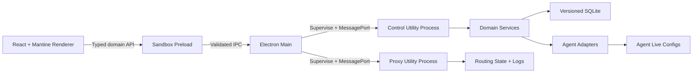

# StackFerry 1.0 总体重写计划

## 产品边界
- 核心定位：面向多 Agent 用户的本地控制台，统一发现 Agent、管理 Provider/Profile/MCP/Skill/Prompt 资产，并安全投影到各 Agent 原生配置。
- 一级对象：`Agent`、`SharedAsset`、`Deployment`、`Health`；共享资产是 StackFerry 主副本，Agent 页面展示实际投影与运行状态。
- 第二阶段核心：纯 TypeScript 本地代理、协议转换、故障转移、请求日志、Token/费用和错误归属。
- 延后评估：Pi 扩展商店、OpenClaw/Hermes 专属控制台、完整会话阅读器、CLI 安装器、WebDAV/S3 双同步、公告运营能力。
- 支持等级统一为 `Core`、`Managed`、`ImportOnly`、`Unsupported`，由单一 capability registry 驱动 UI、IPC 和测试，不再散落布尔矩阵。

## 目标信息架构
- `Overview`：Agent 健康、待应用变更、配置冲突、最近操作。
- `Agents`：Agent 列表与详情；详情含 Provider、MCP、Skills、Prompts、部署历史和诊断。
- `Library`：Universal Providers、Profiles、MCP Registry、Skills、Prompt Library。
- `Routing`（第二阶段）：Routes、Failover、Health、Request Logs、Usage & Cost。
- `System`：Import & Backup、Network、Security、Diagnostics、Updates。
- 使用 TanStack Router 和稳定资源 ID，替代 [src/App.tsx](E:/Project/StackFerry/src/App.tsx) 中的内存 `currentView` 状态机；路由参数与 search state 端到端类型安全，宽屏主从布局与窄屏独立详情统一使用路由返回栈。

## 架构定型

- 保留 [apps/desktop-v1/src](E:/Project/StackFerry/apps/desktop-v1/src) 的 sandbox renderer/preload、Zod 契约、Agent Adapter、React Query 和 Mantine；把数据库、配置文件和长任务从 Electron main 移到 control utility process，main 只拥有窗口、安全策略、更新和进程监督。
- 以当前稳定 Electron 43 / 内置 Node 24 为基线并固定精确版本；升级 Electron 时必须重跑 native module、safeStorage、代理流式和三平台打包 smoke，不跟随 caret 自动跨版本。
- IPC 按领域定义请求、响应、稳定错误码和权限；校验 sender/frame，加入严格 CSP、全局 sandbox、权限 handler、导航/新窗/外链白名单。生产 renderer 使用自定义 `app://` 协议，不使用 `file://`，renderer 永不获得 Node、文件或通用 `invoke` 权限。
- 废弃原型的单表 JSON 快照 [database.ts](E:/Project/StackFerry/apps/desktop-v1/src/main/database.ts)。先做 `better-sqlite3 + Drizzle` 与 Electron 内置 `node:sqlite` POC：比较迁移、备份、authorizer/defensive 能力、Electron ABI、三平台打包和性能；生产默认选择成熟的 `better-sqlite3 + Drizzle` 并在 control process 串行拥有连接，只有 POC 证明内置驱动达到同等门禁才改选。
- 建立版本化关系 schema、迁移前备份、`user_version` 新版本拒绝、完整性检查和事务恢复；migration 作为签名应用资源打包并校验哈希，不从可写目录动态执行任意 SQL。
- 小型凭据使用 Electron 异步 `safeStorage` 加密后再持久化；Linux 检测到 `basic_text` 时禁止静默保存密钥，明确提示用户启用 Secret Service/KWallet 或选择仅会话保存。凭据 DTO 默认不可序列化到 renderer，UI 只获得存在性和掩码状态。
- 明确三类状态：1.0 管理资产、Agent 外部 live 状态、扫描缓存；扫描缓存不能覆盖管理资产，所有写入必须经过 `plan -> preview -> backup -> atomic apply -> verify -> commit/rollback`。
- 1.0 使用独立 app ID、用户目录、数据库、更新通道和深链协议；0.x 导入器只读旧 `stackferry.db/settings.json/skills`，生成预览后写入 1.0，绝不修改旧数据。

## 配置控制闭环
- 先建立 adapter contract：`detect`、`inspectVersion`、`read`、`normalize`、`planChanges`、`applyAtomically`、`verify`、`rollback`；结果区分未安装、权限不足、格式损坏、版本不支持、部分能力和成功。
- 配置编辑采用 CST/文本补丁而不是 parse-stringify；为 JSON/JSONC/JSON5/TOML/YAML/Markdown/.env 分别做库选型 POC，优先验证 `jsonc-parser`、lossless JSON5 CST、TOML/YAML document API 及统一 CST 方案。golden fixtures 必须证明未触碰区域字节级不变、未知字段/注释/引号/顺序保留。
- Windows 使用等价于 `ReplaceFileW/MoveFileExW + WRITE_THROUGH` 的原子替换，Unix 保留 mode 和 symlink 边界；写入前记录文件 identity/hash，外部并发修改时中止并重新生成计划。
- 迁移顺序：Claude Code → Gemini → OpenCode → Hermes → Grok Build → Codex → Pi → Claude Desktop；每个 Agent 单独达到 import/write/reload/unknown-field/concurrent-change/rollback parity 后才标记 `Managed`。
- 首批资产为 Provider、MCP、Prompt、Skill 和 Profile；统一目标分配、冲突提示、来源、变更预览、部署历史与恢复，不复制当前分散的应用开关模型。
- 项目级配置需要显式选择与信任；只有 canonical 路径、非 symlink 越界、仍位于项目内且获得信任后才能读写。

## 纯 TypeScript 路由迁移
- 先把现有 [src-tauri/src/proxy](E:/Project/StackFerry/src-tauri/src/proxy) 行为冻结为黑盒契约：原始请求、转换后请求、SSE/WebSocket 字节流、header、超时、断连、背压、重试、熔断、usage 与日志结果。
- 代理运行在独立 utility process，不阻塞 Electron main 或 control process；主进程仅负责认证、生命周期、端口租约、崩溃恢复与状态查询，业务消息通过 MessagePort 和版本化 schema 传输。
- HTTP 客户端固定独立 Undici 版本并使用 `request/stream/pipeline`、Agent/Pool 和 ProxyAgent 等低层 API，不以普通 `fetch` 作为代理内核；所有 response body 必须消费或取消，连接池、header/body timeout、AbortSignal 和 shutdown drain 有明确所有者。
- 按协议迁移：OpenAI Chat/Responses → Claude Messages → Gemini → Pi HTTP → WebSocket；每个协议先完成非流式，再完成流式、取消和故障注入。
- WebSocket 不依赖尚未验证的默认缓冲行为；固定 Undici/WS 实现版本，并用慢消费者、断网、半关闭、超大帧和高水位测试证明收发背压与内存上限。
- 故障转移使用显式状态机，区分可重放与不可重放请求；只有请求体未产生不可逆上游副作用时允许自动重试。默认仅绑定 loopback，非 loopback 必须明确确认并启用本地认证。
- 请求日志统一尝试链、最终上游、duration、TTFT、Token、cost、thinking source 和数据完整度；凭据永不进入 IPC、日志、诊断包或 crash 数据。
- 在协议 golden tests、真实上游 smoke tests 和长时间流式压力测试达到门禁前，1.0 路由保持实验状态，0.x 继续作为稳定回退。

## 工程与发布门禁
- 将 `desktop-v1` 纳入根 scripts 与三平台 CI：typecheck、unit、adapter fixtures、DB migration、Electron E2E、打包 smoke、安装/升级/卸载测试。
- 先做 Electron Forge 与 electron-builder 的打包 POC：比较现有 electron-vite 集成、native rebuild、Windows installer、macOS signing/notarization、Linux AppImage/deb/rpm、GitHub Release 更新和可复现 CI。Forge 为官方首选，但其 Vite 插件仍属 experimental 且 AppImage 非官方 maker；无法稳定覆盖目标矩阵时选择 electron-builder，禁止混用两套 pipeline。
- 建立 ASAR/extraResources、native module rebuild、应用图标、SBOM、依赖审计和供应链 allowlist；签名与 notarization 是更新门禁，不允许“能打包但未签名”被视为可发布。
- 建立签名自动更新、回滚和渠道策略；1.0 更新 manifest 与 0.x Tauri `latest.json` 完全隔离。
- 建立开发沙箱 HOME、临时 Agent fixtures 和测试凭据，任何开发/E2E 测试不得读写用户真实配置。
- 使用 Playwright `_electron.launch` 做真实窗口 E2E，并同时保留 renderer 浏览器测试。真实窗口覆盖 preload/IPC、utility process 重启、打包资源路径、760px 最小宽度及常用桌面尺寸；视觉基线按固定 CI OS/字体生成，禁用动画并隔离动态内容。

## 里程碑与完成标准
1. `Foundation POC`：完成 SQLite driver、配置 CST、Forge/builder、utility process 通信和 Undici 流式小样的证据型选型，删除未选方案。
2. `Foundation`：四进程安全壳、TanStack Router、错误/日志、凭据存储、版本化 DB、备份恢复、三平台 CI、打包与更新 smoke 全部通过。
3. `Read-only Control Plane`：三平台发现全部目标 Agent，展示准确能力、配置来源、损坏/权限错误，扫描单 Agent 失败不拖垮全局。
4. `Managed Configuration`：首批 Agent 完成 Provider/MCP/Prompt/Skill 的预览、原子应用、验证、回滚；0.x 显式导入可重复且不修改源数据。
5. `Configuration Release Candidate`：全部声明为 `Managed` 的 Agent 通过跨平台 fixtures、并发修改和故障注入；可作为不含稳定路由的 1.0 Beta。
6. `TypeScript Routing`：协议转换、流式生命周期、故障转移、熔断和日志逐协议达到 Rust 黑盒基线。
7. `1.0 Stable`：配置与路由核心在三平台通过真实 Agent smoke、升级/回滚、长时间压力和安全审查；才允许替代 0.x，长尾模块另行排期。

## 明确不做
- 不逐文件翻译 Rust，也不直接读取并升级旧数据库。
- 不让 0.x 与 1.0 同时写同一数据库、同步目录或 Agent live 文件。
- 不在 adapter 未通过 round-trip 与 rollback 门禁前提供写入按钮。
- 不以页面数量、Agent 数量或“能启动”作为 1.0 完成标准。